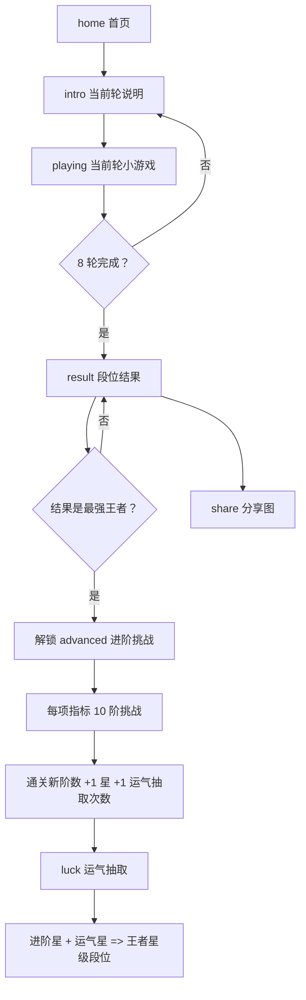
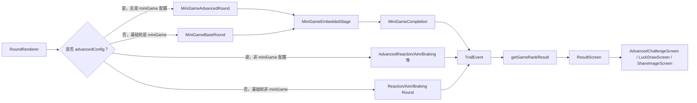

# 项目当前状态与玩法全量说明

生成时间：2026-05-15  
项目路径：`D:\GameTest`  
当前分支：`main`  
盘点时最新提交：`d3943cd Optimize square jump and fall down rendering`  
应用名称：`测测你的游戏段位`

> 本文档根据当前代码、README、测试文件和项目进度记录整理。它描述的是当前项目真实实现状态，不是未来设计稿。

## 1. 当前总状态

这是一个移动端优先的 Next.js/React 游戏测试原型。用户完成 8 个小游戏后得到一个段位结果；达到“最强王者”后，解锁每个指标的 10 阶进阶挑战和“运气”抽取系统。

当前正式可访问入口只有首页 `/`。旧的 `/mini-game-prototypes` 独立原型测试路由已经移除；`src/app/mini-game-prototypes.tsx` 仍存在，但它现在是正式流程复用的嵌入式小游戏组件，不是独立页面。

项目当前没有账号、后端写入、数据库、在线排行榜或服务器持久化。所有成绩、当前结果、进阶进度、运气抽取次数都在浏览器本地 `localStorage` 中保存。

盘点过程中检测到当前工作区存在未提交源码变更：`src/app/page.tsx`、`src/lib/scoring.ts`、`src/lib/scoring.test.ts`。本文档按当前工作区内容描述状态，但这些源码改动未由本文档生成过程修改，也未在本文档生成后做代码修复。

当前本地开发服务器配置记录在 `.dev-server.json`：

```json
{"port":3000,"pid":2272,"url":"http://127.0.0.1:3000"}
```

## 2. 搭建形式

### 技术栈

| 层 | 当前实现 |
|---|---|
| 框架 | Next.js `16.2.6` |
| UI | React `19.2.4`、React DOM `19.2.4` |
| 语言 | TypeScript |
| 样式 | `src/app/globals.css` 全局 CSS |
| 分享二维码 | `qrcode` |
| 测试 | Node 内置 test runner，使用 `--experimental-strip-types` 跑 TypeScript 测试 |
| Lint | ESLint 9 + Next Core Web Vitals + Next TypeScript |
| 持久化 | 浏览器 `localStorage` |
| 后端 | 无 |

### 常用命令

PowerShell 下优先使用 `npm.cmd`：

```bash
npm.cmd install
npm.cmd run dev
npm.cmd test
npm.cmd run lint
npm.cmd run build
```

`package.json` 当前脚本：

```json
{
  "dev": "next dev",
  "build": "next build",
  "start": "next start",
  "lint": "eslint",
  "test": "node --test --experimental-strip-types src/**/*.test.ts"
}
```

### 主要文件分工

| 文件 | 作用 |
|---|---|
| `src/app/page.tsx` | 首页、8 轮正式测试流程、结果页、分享图生成页、进阶挑战页、运气页、路由状态机 |
| `src/app/mini-game-prototypes.tsx` | Doodle、Flappy、Knife、方块跃迁、一路向下 5 个嵌入式小游戏运行组件 |
| `src/app/globals.css` | 全局样式、移动端布局、小游戏舞台、结果页、进阶页、分享页样式 |
| `src/app/layout.tsx` | 页面 metadata、Open Graph、Twitter card、中文语言设置 |
| `src/lib/scoring.ts` | TrialEvent 数据结构、基础成绩计算、雷达图轴、总段位计算、分享文案 |
| `src/lib/advanced-progress.ts` | localStorage schema、进阶星数、运气抽取、返回行为、进阶状态 |
| `src/lib/advanced-challenges.ts` | 8 项指标的 10 阶进阶配置和通关判定 |
| `src/lib/mini-game-prototypes.ts` | 5 个嵌入式小游戏的关卡配置、随机生成、命中/碰撞/相机/布局纯函数 |
| `src/lib/advanced-aim.ts` | 进阶精准度箭矢物理和碰撞纯函数 |
| `src/lib/advanced-memory.ts` | 进阶记忆相关遗留/通用纯函数 |
| `src/lib/search-scenes.ts` | 搜索场景相关遗留/通用纯函数 |
| `public/share-card.png` | 微信/社交分享缩略图 |

### 当前测试文件

| 测试文件 | 覆盖重点 |
|---|---|
| `advanced-aim.test.ts` | 进阶移动靶/箭矢逻辑 |
| `advanced-challenges.test.ts` | 进阶配置、通关判定、正式映射 |
| `advanced-memory.test.ts` | 进阶记忆纯函数 |
| `advanced-progress.test.ts` | 本地进度、星数、运气、返回行为 |
| `advanced-rank.test.ts` | 进阶王者段位星级映射 |
| `luck-animation.test.ts` | 运气滚轮动画调度 |
| `mini-game-prototypes.test.ts` | 5 个小游戏配置、生成、运行约束、性能约束 |
| `obsolete-features.test.ts` | 已替换/删除旧玩法的防回归断言 |
| `scoring.test.ts` | 基础计分、段位、分享文案 |
| `search-scenes.test.ts` | 搜索场景纯函数 |

## 3. 页面与应用状态机

当前应用用单页状态切换，不依赖多个页面路由。核心 `stage` 类型来自 `advanced-progress.ts`：

```ts
type AppStage = "home" | "intro" | "playing" | "result" | "share" | "advanced" | "luck";
```

### 状态含义

| 状态 | 含义 |
|---|---|
| `home` | 首页，展示标题、开始测试、默认分享入口 |
| `intro` | 当前轮游戏开始前的规则说明 |
| `playing` | 正式 8 轮测试中的某一轮正在运行 |
| `result` | 8 轮完成后的段位结果页 |
| `share` | 生成分享图、复制分享文案、展示图片 |
| `advanced` | 进阶挑战选关、介绍、挑战中、挑战完成 |
| `luck` | 运气抽取页，支持单抽和十连 |

### 主流程



### 浏览器返回处理

项目不是简单依赖浏览器默认返回，而是用 `history.pushState/replaceState` 写入内部层级：

| 层级 | 用途 |
|---|---|
| `0` | 没有内部拦截，浏览器正常返回 |
| `1` | 普通页面守卫，例如分享页、运气页、普通进阶页 |
| `2` | 进阶挑战中从 playing/complete 返回 challenge 选择层 |

当处于 `intro`、`playing`、`share`、`luck`、`advanced` 等状态时，返回按钮会根据来源决定是释放、拦截还是回到结果页/挑战页。

## 4. 当前正式 8 轮测试

正式测试固定 8 轮，顺序写在 `src/app/page.tsx` 的 `rounds` 中。

| 顺序 | roundId | 页面标题 | 指标名 | 当前正式玩法 | 基础规则 | 基础失败处理 |
|---:|---|---|---|---|---|---|
| 1 | `reaction` | 变色点我 | 反应力 | React 内置反应点击 | 等区域变绿后再点，提前点记为误点；首轮练习，后 3 轮计分 | 提前点、超时都记录 TrialEvent；满 4 步后进入下一轮 |
| 2 | `aim` | 移动靶 | 精准度 | 复用 `AdvancedAimRound` 的基础箭靶配置 | 点击屏幕发射箭，当前基础配置为椭圆轨迹靶；不限总箭数，命中 8 次后进入下一轮 | 当前基础配置记录发射次数、命中数和所需命中数；分数按命中数/尝试数折算 |
| 3 | `search` | 一路向上 | 连续反应 | 嵌入 `doodle-base` | 拖动小方块左右移动，踩平台上升，到达 3 屏高度 | 基础关失败会补平台续跑；多次失败后结算进入下一轮 |
| 4 | `stroop` | 一路向下 | 专注力 | 嵌入 `fall-down-base` | 左右半屏控制小方块，落到更低的平台，下降 10 层 | 基础关失误会在当前相机中线生成安全平台续跑；多次失败后结算 |
| 5 | `rhythm` | 跳一跳 | 节奏感 | 嵌入 `square-jump-base` | 长按蓄力，松手跳到下一个平台，连续跳跃 | 基础关失误会重置到原本的下一个平台续跑；失败达到阈值后结算 |
| 6 | `memory` | 一路向前 | 手眼协调 | 嵌入 `flappy-base` | 点击让小方块起飞并控制高度，通过 6 个门 | 撞到障碍会闪烁复位继续；多次失败后结算 |
| 7 | `braking` | 小方块急停 | 控制力 | React 内置急停，正在向进阶危险放置逻辑靠拢 | 长按前进，危险出现时立刻松手；提前松手或撞上危险扣分 | 当前工作区配置为 5 次急停试次后进入下一轮 |
| 8 | `patience` | 飞刀连射 | 时机判断 | 嵌入 `knife-base` | 点击发射长条，避开已插入长条，发射 6 个 | 基础关失败不打断，发射完后按命中表现计分 |

> 注意：README 中仍有旧指标文案“侦察力、记忆力、耐心”；当前代码结果页实际使用的是“连续反应、手眼协调、时机判断”。这是当前文档发现的命名残留。

## 5. 基础轮计分与 TrialEvent

所有玩法完成后都会生成 `TrialEvent[]`，最终由 `getGameRankResult(trials)` 统一计算段位。

核心事件结构：

| 字段 | 含义 |
|---|---|
| `roundId` | 当前指标：`reaction`、`aim`、`search`、`stroop`、`rhythm`、`memory`、`braking`、`patience` |
| `trialIndex` | 本轮内第几次试次 |
| `pointerType` | `mouse`、`touch`、`pen`、`unknown` |
| `viewport` | 记录宽高和 DPR |
| `scheduledAt` | 计划出现时间 |
| `shownAt` | 实际出现时间 |
| `responseAt` | 响应时间；未响应为 `null` |
| `correct` | 是否正确 |
| `errorType` | `early`、`miss`、`wrong`、`timeout`、`false_alarm`、`skip`、`visibility`、`collision`、`early_stop` |
| `target` | 目标位置、大小、距离、难度等 |
| `value` | 玩法自定义数据，例如 miniGameId、score、failures、elapsedMs、hit 信息 |

### 嵌入小游戏基础分

基础轮里 5 个嵌入小游戏都会先得到一个 `MiniGameCompletion`，再换算成对应指标的 TrialEvent。

非飞刀类基础分：

```text
score = clamp(progressPercent + 通关奖励8 - failures * 16, 0, 100)
```

飞刀类基础分：

```text
score = clamp((hits / shotCount) * 100 - failures * 8, 0, 100)
```

基础嵌入小游戏 TrialEvent 的 `correct` 条件：

```text
outcome.status === "passed" && score >= 60
```

## 6. 段位与结果系统

### 八项成绩轴

| ScoreSummary 字段 | 结果页显示 | 来源 |
|---|---|---|
| `reaction` | 反应力 | `reaction` TrialEvent 的反应中位数、一致性、提前点击惩罚 |
| `targeting` | 精准度 | `aim` 命中率；当前基础箭靶为不限箭数命中 8 次，按命中数/尝试数体现效率 |
| `search` | 连续反应 | `doodle` 基础小游戏分 |
| `interference` | 专注力 | `fall-down` 基础小游戏分 |
| `rhythm` | 节奏感 | `square-jump` 基础小游戏分 |
| `memory` | 手眼协调 | `flappy` 基础小游戏分 |
| `braking` | 控制力 | 急停成功率和平均急停延迟；当前基础完成度阈值为 5 次急停试次 |
| `waiting` | 时机判断 | `knife` 基础小游戏分 |
| `confidence` | 完成度 | 8 项完成数量换算，满 8 项为 100 |

### 段位计算

总分 `rankScore` 先取 8 项均值，再根据核心短板和完成度扣分：

```text
equalAverage = 8 项分数平均
minCore = 前 7 项核心分最低值，不含 waiting
weakPenalty =
  max(0, 70 - minCore) * 0.38 +
  max(0, 58 - minCore) * 0.34 +
  max(0, 45 - minCore) * 0.42
confidencePenalty = max(0, 100 - confidence) * 0.35
rankScore = clamp(equalAverage - weakPenalty - confidencePenalty)
```

基础段位阈值：

| 条件 | 段位 |
|---|---|
| `confidence < 55` 或 `rankScore < 35` | 热血青铜 |
| `rankScore < 50` 或 `minCore < 35` | 秩序白银 |
| `rankScore < 62` 或 `minCore < 45` | 荣耀黄金 |
| `rankScore < 74` 或 `minCore < 55` | 尊贵铂金 |
| `rankScore < 84` 或 `minCore < 65` | 永恒钻石 |
| `rankScore < 90` 或 `minCore < 76` | 至尊星耀 |
| 以上都通过 | 最强王者 |

达到“最强王者”后，会标记 `advancedProgress.unlocked = true`，结果页 8 项指标旁显示进阶入口，并显示“运气”长卡。

## 7. 五个嵌入式小游戏总览

5 个嵌入式小游戏都使用统一舞台常量：

| 常量 | 值 |
|---|---:|
| 舞台宽度 | `360` |
| 舞台高度 | `640` |
| 玩家方块尺寸 | `32` |
| 基础失败阈值 | `BASE_FAILURE_LIMIT = 3` |
| UI 同步节流 | `MINI_GAME_UI_SYNC_MS = 120` |
| 计时 UI 同步 | `MINI_GAME_TIMER_SYNC_MS = 100` |

### 7.1 Doodle Jump 型：一路向上

正式基础轮映射：`search` / 连续反应。  
操作：左右拖动控制角色，踩平台向上。  
基础目标：到达 3 屏高度。  
进阶目标：通过更高高度、移动平台、必踩高风险平台、移动障碍组合考验连续反应。

关键机制：

| 机制 | 当前实现 |
|---|---|
| 世界生成 | `generateDoodleWorldLayout` 根据关卡参数生成平台和障碍 |
| 可见裁剪 | `selectVisibleDoodlePlatforms`、`selectVisibleDoodleHazards` |
| 移动平台 | 按比例生成，速度来自 `movingPlatformSpeed` |
| 高风险平台 | 必须踩够 `requiredRiskPlatforms`，踩中后用 `riskJumpMultiplier` 弹跳 |
| 障碍 | 可水平、垂直、斜向巡逻、小轨道、脉冲、慢速横穿 |
| 基础失败续跑 | 失败后在当前相机位置补普通平台、给短暂无敌，并继续；超过阈值后结算 |
| 进阶失败 | 进阶模式失败会直接结束挑战 |

进阶层级：

| 关卡 | 主题 | 难度 | 目标 | 关键参数 |
|---|---|---|---|---|
| 1-1 | 移动平台 | 简单 | 到达 4 屏高度 | 移动平台 40%，速度 22，危险密度 0.45 |
| 1-2 | 移动平台 | 普通 | 到达 6 屏高度 | 移动平台 70%，速度 34，危险密度 0.8 |
| 1-3 | 移动平台 | 困难 | 到达 8 屏高度 | 全平台移动，速度 46，危险密度 1.2 |
| 1-4 | 必踩高风险平台 | 简单 | 到达 5 屏，必踩 3/3 | 高风险平台宽 88，弹跳 1.6 倍 |
| 1-5 | 必踩高风险平台 | 普通 | 到达 7 屏，必踩 5/5 | 高风险平台宽 76，部分更偏 |
| 1-6 | 必踩高风险平台 | 困难 | 到达 9 屏，必踩 7/7 | 高风险平台宽 64，危险密度 1.15 |
| 1-7 | 移动障碍 | 简单 | 到达 5 屏 | 5 个水平移动障碍，速度 24 |
| 1-8 | 移动障碍 | 普通 | 到达 7 屏 | 9 个障碍，水平/垂直/斜向巡逻 |
| 1-9 | 移动障碍 | 困难 | 到达 9 屏 | 13 个障碍，多种运动模式 |
| 1-10 | 综合最终关 | 最终 | 到达 10 屏，必踩 8/8 | 全移动平台、20 个障碍、8 个必踩平台 |
| 基础关 | 基础关 | 基础 | 到达 3 屏 | 静态平台、无危险、无必踩 |

### 7.2 Flappy Bird 型：一路向前

正式基础轮映射：`memory` / 手眼协调。  
操作：点击屏幕调整高度，穿过门洞；部分进阶关要求收集路径道具。  
基础目标：通过 6 个固定门。  
进阶目标：移动门、必收集道具、反重力反向移动。

关键机制：

| 机制 | 当前实现 |
|---|---|
| 门生成 | `generateFlappyGateLayout` |
| 屏幕位置 | `getFlappyGateScreenX` 根据 progress 和方向计算 |
| 移动门 | `movingGateRatio` 控制比例，`movingGateSpeed` 控制摆动 |
| 收集物 | `collectibleCount` 和 `collectibleOffset` 控制数量与偏移 |
| 反重力/反向 | `reversedGravity` 和 `reverseDirection` 同时开启时，从右往左移动，点击向下压 |
| 基础失败续跑 | 撞门/飞出边界后向后回退 progress、复位高度、短暂无敌继续 |
| 进阶失败 | 漏收集、撞门、飞出边界会结束挑战 |

进阶层级：

| 关卡 | 主题 | 难度 | 目标 | 关键参数 |
|---|---|---|---|---|
| 2-1 | 移动门 | 简单 | 通过 8 门 | 移动门 30%，缝隙 190，速度 116 |
| 2-2 | 移动门 | 普通 | 通过 10 门 | 移动门 50%，缝隙 168，速度 128 |
| 2-3 | 移动门 | 困难 | 通过 12 门 | 移动门 70%，缝隙 152，速度 140 |
| 2-4 | 收集路径道具 | 简单 | 通过 8 门，收集 4/4 | 道具偏移 0.18 |
| 2-5 | 收集路径道具 | 普通 | 通过 10 门，收集 6/6 | 道具偏移 0.28 |
| 2-6 | 收集路径道具 | 困难 | 通过 12 门，收集 8/8 | 道具偏移 0.36 |
| 2-7 | 重力反转 + 反向移动 | 简单 | 通过 6 门 | 反重力、反向、缝隙 196，速度 106 |
| 2-8 | 重力反转 + 反向移动 | 普通 | 通过 8 门 | 反重力、反向、缝隙 172，速度 122 |
| 2-9 | 重力反转 + 反向移动 | 困难 | 通过 10 门 | 反重力、反向、缝隙 154，速度 136 |
| 2-10 | 综合最终关 | 最终 | 通过 13 门，收集 7/7 | 反向反重力、移动门 45%、道具 7 个 |
| 基础关 | 基础关 | 基础 | 通过 6 门 | 固定门、缝隙 190、速度 118 |

### 7.3 Knife Hit 型：飞刀连射

正式基础轮映射：`patience` / 时机判断。  
操作：点击发射长条，避开已插入物体和禁区。  
基础目标：命中 6 发。  
进阶目标：倒计时发射、正弦转速、不可插区域、最终混合。

关键机制：

| 机制 | 当前实现 |
|---|---|
| 转盘几何 | `KNIFE_WHEEL_SIZE = 190`，插入半径 `74` |
| 发射 | 点击后飞行 `KNIFE_FLIGHT_MS = 95` |
| 命中角度 | `getLocalHitAngle` 根据发射角和转盘角计算局部角度 |
| 碰撞 | `resolveKnifeShotOutcome` 判断撞旧刀、命中禁区或成功 |
| 碰撞阈值 | `KNIFE_COLLISION_DEGREES = 8` |
| 正弦转速 | `getSineAngularVelocity` 控制速度从 0 到正反最快循环 |
| 禁区 | `generateKnifeForbiddenZones` 生成不可插扇区 |
| 初始障碍 | `generateKnifeInitialAngles` 生成已有插入物 |
| 基础失败 | 基础模式撞到或命中禁区不立即中断，计入失败并消耗一次发射 |
| 进阶失败 | 进阶模式撞到、命中禁区或倒计时结束直接失败 |

进阶层级：

| 关卡 | 主题 | 难度 | 目标 | 关键参数 |
|---|---|---|---|---|
| 3-1 | 发射倒计时 | 简单 | 命中 7 发 | 每发 3.0 秒，初始障碍 1，转速 82 |
| 3-2 | 发射倒计时 | 普通 | 命中 9 发 | 每发 2.5 秒，初始障碍 2，转速 96 |
| 3-3 | 发射倒计时 | 困难 | 命中 11 发 | 每发 2.0 秒，初始障碍 3，转速 106 |
| 3-4 | 转速正弦波动 | 简单 | 命中 7 发 | 周期参数 3，扫速 390，初始障碍 1 |
| 3-5 | 转速正弦波动 | 普通 | 命中 9 发 | 周期参数 2.8，扫速 405，初始障碍 2 |
| 3-6 | 转速正弦波动 | 困难 | 命中 11 发 | 周期参数 2.55，扫速 420，初始障碍 3 |
| 3-7 | 不可插区域 | 简单 | 命中 7 发并避开禁区 | 1 块禁区，占比 12% |
| 3-8 | 不可插区域 | 普通 | 命中 9 发并避开禁区 | 2 块禁区，占比 18% |
| 3-9 | 不可插区域 | 困难 | 命中 11 发并避开禁区 | 3 块禁区，占比 24% |
| 3-10 | 综合最终关 | 最终 | 命中 13 发，避开禁区和旧刀 | 倒计时 2.3 秒、正弦转速、2 块禁区 |
| 基础关 | 基础关 | 基础 | 命中 6 发 | 匀速转盘，初始障碍 1，转速 88 |

### 7.4 方块跃迁：跳一跳

正式基础轮映射：`rhythm` / 节奏感。  
操作：长按蓄力，松手跳到下一个平台。  
基础目标：连续完成 8 次跳跃。  
进阶目标：移动落点、二段跳、重力平台、最终综合。

关键机制：

| 机制 | 当前实现 |
|---|---|
| 蓄力 | 最大蓄力 `900ms`；使用 `smoothStep` 转换距离 |
| 基础距离 | `powerDistanceMin = 34`，`powerDistanceMax = 220` |
| 二段跳距离 | `secondPowerDistanceMin = 30`，`secondPowerDistanceMax = 180` |
| 二段跳 | 空中可再次蓄力；二段蓄力时悬停；开启 `cyclingChargeOnDoubleJump` 后蓄力条循环 |
| 重力倍率 | normal `1`，light `1.55`，heavy `0.58` |
| 平台生成 | `generateSquareJumpPlatformSequence` 生成随机但可复现的序列 |
| 相机 | `fitSquareJumpBaseCamera` 保证当前平台、目标平台和玩家可见 |
| 掉落补判 | 跳过目标后飞出轨迹若再次穿过目标平台顶部，可判定成功 |
| 移动平台 | 按 `sin(time * speed + phase) * range` 移动 |
| 失败续跑 | 基础关失败后进入下一个平台继续；失败达到阈值后结算 |
| 视觉反馈 | 玩家蓄力有挤压反馈；预测指示默认关闭但可由玩家打开 |

进阶层级：

| 关卡 | 主题 | 难度 | 目标 | 关键参数 |
|---|---|---|---|---|
| 1-1 | 移动落点 | 简单 | 连续完成 7 次跳跃 | 平台宽 100，1 个慢速移动平台，速度 1.35，范围 34 |
| 1-2 | 移动落点 | 普通 | 连续完成 8 次跳跃 | 平台宽 82，3 个移动平台，速度 1.9，范围 48 |
| 1-3 | 移动落点 | 困难 | 连续完成 9 次跳跃 | 平台宽 68，9 个移动平台，速度 2.6，范围 58，反向移动 |
| 2-1 | 二段跳跃 | 简单 | 连续完成 5 次跳跃 | 距离 296-350，二段跳开启，二段蓄力循环 |
| 2-2 | 二段跳跃 | 普通 | 连续完成 6 次跳跃 | 距离 320-385，平台宽 82 |
| 2-3 | 二段跳跃 | 困难 | 连续完成 7 次跳跃 | 距离 350-415，平台宽 70 |
| 3-1 | 重力平台 | 简单 | 连续完成 7 次跳跃 | 重力序列 normal/light/normal/light |
| 3-2 | 重力平台 | 普通 | 连续完成 8 次跳跃 | 重力序列 normal/light/heavy/normal/light |
| 3-3 | 重力平台 | 困难 | 连续完成 12 次跳跃 | 重力序列 light/normal/heavy/light/heavy/normal，平台宽 68 |
| 最终关 | 方块终跃 | 最终 | 连续完成 15 次跳到终点 | 移动平台 + 二段跳 + 重力切换 + 反向移动 |
| 基础关 | 基础关 | 基础 | 连续完成 8 次跳跃 | 普通平台，距离 136-226，平台宽 110 |

### 7.5 一路向下：Fall Down 型

正式基础轮映射：`stroop` / 专注力。  
操作：左右半屏控制小方块横向移动，持续落到更低的平台。  
基础目标：下降 10 层到终点。  
进阶目标：移动层板、脆弱层板、危险层板、最终百层试炼。

关键机制：

| 机制 | 当前实现 |
|---|---|
| 平台类型 | `normal`、`moving`、`fragile`、`danger`、`finish` |
| 平台形状 | `flat`、`l-left`、`l-right` |
| 角色控制 | 左右半屏输入，基础速度 `playerSpeed = 230` |
| 顶部压线 | `topPressureSpeed` 控制上方压力向下推进 |
| 移动层板 | `movingPlatformCount`、`movingSpeed`、`movingRange` |
| 脆弱层板 | 踩上后 `fragileTime` 秒碎裂 |
| 危险层板 | 红色危险平台，踩到失败 |
| 下落危险物 | `fallingHazardCount`、速度、尺寸控制 |
| 凸出层板 | `ledgePlatformCount` 提供更窄/偏移路线 |
| 基础失败续跑 | 当前相机中线生成安全平台，玩家复位继续；达到阈值后结算 |
| 进阶失败 | 掉出、压线、危险碰撞等直接失败 |

进阶层级：

| 关卡 | 主题 | 难度 | 目标 | 关键参数 |
|---|---|---|---|---|
| 1-1 | 移动层板 | 简单 | 通过慢速移动层板 | 14 层，平台宽 104，移动 7 个，压线 44 |
| 1-2 | 移动层板 | 普通 | 通过连续移动层板 | 18 层，平台宽 84，移动 11 个，压线 54，坠落物 2 |
| 1-3 | 移动层板 | 困难 | 通过高压移动层板 | 22 层，平台宽 68，移动 16 个，压线 66，反向移动 |
| 2-1 | 脆弱层板 | 简单 | 避开碎裂压力下降 | 14 层，脆弱 7 个，碎裂 1.8 秒 |
| 2-2 | 脆弱层板 | 普通 | 连续通过脆弱层板 | 18 层，脆弱 11 个，碎裂 1.35 秒 |
| 2-3 | 脆弱层板 | 困难 | 在碎裂前连续下降 | 22 层，脆弱 16 个，碎裂 0.95 秒 |
| 3-1 | 危险层板 | 简单 | 避开危险平台下降 | 14 层，危险 5 个，压线 46 |
| 3-2 | 危险层板 | 普通 | 选择安全层板下降 | 18 层，危险 8 个，坠落物 2 |
| 3-3 | 危险层板 | 困难 | 连续避开危险层板 | 22 层，危险 11 个，坠落物 2，凸出层板 5 |
| 最终关 | 百层试炼 | 最终 | 完成百层试炼 | 30 层，移动 12、脆弱 10、危险 10、坠落物 4、凸出 8 |
| 基础关 | 基础关 | 基础 | 下降 10 层到终点 | 普通平台，宽 112，间距 96-132，压线 42 |

## 8. 进阶挑战系统

进阶入口在结果页每个指标卡片旁。只有满足以下任一条件才显示：

```text
advancedProgress.unlocked === true
或当前结果 result.name === "最强王者"
```

### 解锁和存储

进阶进度结构：

| 字段 | 含义 |
|---|---|
| `schemaVersion` | 当前为 `1` |
| `unlocked` | 是否解锁进阶 |
| `dimensions` | 8 个指标各自的 10 阶进度 |
| `clearedLevels` | 每阶是否首次通关 |
| `attempts` | 每阶尝试次数 |
| `bestScores` | 每阶历史最高分 |
| `luckStars` | 运气星，0-20 |
| `luckBestScore` | 运气历史最高抽分 |
| `luckDrawChances` | 当前可抽次数 |
| `luckDrawCount` | 历史已抽次数 |
| `updatedAt` | 更新时间 |

localStorage key：

```text
game-rank-test/state/v1
```

### 进阶选关规则

| 状态 | 含义 |
|---|---|
| `completed` | 当前阶及之前已完成 |
| `current` | 下一个可挑战阶 |
| `locked` | 尚未解锁 |

只能挑战已完成阶和下一个当前阶。通关新阶时：

```text
该指标 +1 阶
总进阶星 +1
luckDrawChances +1
```

每个指标最多 10 星，8 项共 80 星。

### 进阶难度排序

迷你游戏类进阶不是简单按配置文件原顺序 1-10 呈现，而是按统一分层顺序：

```text
1, 4, 7, 2, 5, 8, 3, 6, 9, 10
```

也就是先给三个主题的简单版，再给三个主题的普通版，再给三个主题的困难版，最后是综合最终关。

## 9. 八项进阶玩法明细

### 9.1 反应力进阶：变色点我

| 阶 | 玩法 | 难度 | 通关要求 |
|---:|---|---|---|
| 1 | 单路红灯陷阱 | easy | 完成 5 个红绿信号，红灯不能点，平均反应 ≤ 350ms |
| 2 | 双路绿灯 | easy | 完成 5 次绿灯点击，平均反应 ≤ 350ms |
| 3 | 双路红灯陷阱 | easy | 完成 5 个红绿信号，红灯不能点，平均反应 ≤ 350ms |
| 4 | 单路红灯陷阱 | medium | 完成 6 个红绿信号，红灯不能点，平均反应 ≤ 300ms |
| 5 | 双路绿灯 | medium | 完成 6 次绿灯点击，平均反应 ≤ 300ms |
| 6 | 双路红灯陷阱 | medium | 完成 6 个红绿信号，红灯不能点，平均反应 ≤ 300ms |
| 7 | 单路红灯陷阱 | hard | 完成 7 个红绿信号，红灯不能点，平均反应 ≤ 250ms |
| 8 | 双路绿灯 | hard | 完成 7 次绿灯点击，平均反应 ≤ 250ms |
| 9 | 双路红灯陷阱 | hard | 完成 7 个红绿信号，红灯不能点，平均反应 ≤ 250ms |
| 10 | 四格 Boss | boss | 累计 8 次绿格点击，红格不能点，平均反应 ≤ 250ms |

失败判定：点红灯、漏点、平均反应超阈值都会失败。

### 9.2 精准度进阶：移动靶

| 阶 | 玩法 | 难度 | 通关要求 |
|---:|---|---|---|
| 1 | 圆形轨迹靶 | easy | 8 箭全中圆形轨迹靶 |
| 2 | 飞入靶 | easy | 连续命中所有飞入靶，靶子飞出算失败 |
| 3 | 干扰靶 | easy | 只打高亮目标，不碰 1 个干扰靶 |
| 4 | 椭圆变速轨迹靶 | medium | 8 箭全中椭圆变速轨迹靶 |
| 5 | 飞入靶 | medium | 连续命中所有飞入靶，靶子飞出算失败 |
| 6 | 干扰靶 | medium | 只打高亮目标，不碰 2 个干扰靶 |
| 7 | 8 字轨迹靶 | hard | 8 箭全中 8 字轨迹靶 |
| 8 | 高速飞入靶 | hard | 连续命中所有飞入靶，靶子飞出算失败 |
| 9 | 多干扰靶 | hard | 只打高亮目标，不碰 3 个干扰靶 |
| 10 | 组合靶场 | boss | 组合靶场全中，不能射中干扰靶，目标飞出算失败 |

关键参数：第 10 阶为 10 发、3 个干扰靶、目标尺寸 42、飞入生成间隔 680ms、飞出即失败。

### 9.3 连续反应进阶：一路向上 / Doodle

| 阶 | 映射关卡 | 主题 | 通关要求 |
|---:|---|---|---|
| 1 | `doodle-1` | 移动平台简单 | 到达 4 屏高度 |
| 2 | `doodle-4` | 高风险平台简单 | 到达 5 屏高度，必踩 3/3 |
| 3 | `doodle-7` | 移动障碍简单 | 到达 5 屏高度 |
| 4 | `doodle-2` | 移动平台普通 | 到达 6 屏高度 |
| 5 | `doodle-5` | 高风险平台普通 | 到达 7 屏高度，必踩 5/5 |
| 6 | `doodle-8` | 移动障碍普通 | 到达 7 屏高度 |
| 7 | `doodle-3` | 移动平台困难 | 到达 8 屏高度 |
| 8 | `doodle-6` | 高风险平台困难 | 到达 9 屏高度，必踩 7/7 |
| 9 | `doodle-9` | 移动障碍困难 | 到达 9 屏高度 |
| 10 | `doodle-10` | 综合最终关 | 到达 10 屏高度，必踩 8/8 |

### 9.4 专注力进阶：一路向下 / Fall Down

| 阶 | 映射关卡 | 主题 | 通关要求 |
|---:|---|---|---|
| 1 | `fall-down-moving-easy` | 移动层板简单 | 通过慢速移动层板 |
| 2 | `fall-down-fragile-easy` | 脆弱层板简单 | 避开碎裂压力下降 |
| 3 | `fall-down-danger-easy` | 危险层板简单 | 避开危险平台下降 |
| 4 | `fall-down-moving-normal` | 移动层板普通 | 通过连续移动层板 |
| 5 | `fall-down-fragile-normal` | 脆弱层板普通 | 连续通过脆弱层板 |
| 6 | `fall-down-danger-normal` | 危险层板普通 | 选择安全层板下降 |
| 7 | `fall-down-moving-hard` | 移动层板困难 | 通过高压移动层板 |
| 8 | `fall-down-fragile-hard` | 脆弱层板困难 | 在碎裂前连续下降 |
| 9 | `fall-down-danger-hard` | 危险层板困难 | 连续避开危险层板 |
| 10 | `fall-down-final` | 综合最终关 | 完成百层试炼 |

### 9.5 节奏感进阶：跳一跳 / 方块跃迁

| 阶 | 映射关卡 | 主题 | 通关要求 |
|---:|---|---|---|
| 1 | `square-jump-moving-easy` | 移动落点简单 | 预判移动平台并完成 4 次跳跃 |
| 2 | `square-jump-double-easy` | 二段跳简单 | 用二段跳完成 4 次跳跃 |
| 3 | `square-jump-gravity-easy` | 重力平台简单 | 根据重力状态完成 4 次跳跃 |
| 4 | `square-jump-moving-normal` | 移动落点普通 | 预判移动平台并完成 5 次跳跃 |
| 5 | `square-jump-double-normal` | 二段跳普通 | 用二段跳完成 5 次跳跃 |
| 6 | `square-jump-gravity-normal` | 重力平台普通 | 根据三种重力完成 5 次跳跃 |
| 7 | `square-jump-moving-hard` | 移动落点困难 | 预判快速移动平台并完成 6 次跳跃 |
| 8 | `square-jump-double-hard` | 二段跳困难 | 用二段跳完成 6 次跳跃 |
| 9 | `square-jump-gravity-hard` | 重力平台困难 | 根据重力反向考验完成 6 次跳跃 |
| 10 | `square-jump-final` | 综合最终关 | 连续跳到终点平台 |

### 9.6 手眼协调进阶：一路向前 / Flappy

| 阶 | 映射关卡 | 主题 | 通关要求 |
|---:|---|---|---|
| 1 | `flappy-1` | 移动门简单 | 通过 8 个门 |
| 2 | `flappy-4` | 收集路径道具简单 | 通过 8 门，收集 4/4 |
| 3 | `flappy-7` | 反重力反向简单 | 通过 6 个门 |
| 4 | `flappy-2` | 移动门普通 | 通过 10 个门 |
| 5 | `flappy-5` | 收集路径道具普通 | 通过 10 门，收集 6/6 |
| 6 | `flappy-8` | 反重力反向普通 | 通过 8 个门 |
| 7 | `flappy-3` | 移动门困难 | 通过 12 个门 |
| 8 | `flappy-6` | 收集路径道具困难 | 通过 12 门，收集 8/8 |
| 9 | `flappy-9` | 反重力反向困难 | 通过 10 个门 |
| 10 | `flappy-10` | 综合最终关 | 通过 13 门，收集 7/7 |

### 9.7 控制力进阶：小方块急停

| 阶 | 主题 | 难度 | 通关要求 |
|---:|---|---|---|
| 1 | 单红危险 | easy | 长按前进，红色危险出现时松手，到终点 |
| 2 | 红灰混合 | easy | 红色松手，灰色继续按住，到终点 |
| 3 | 双路单红规则 | easy | 单个红色松手，两个红色继续按住，到终点 |
| 4 | 单红连续危险 | medium | 长按前进，连续处理红色危险，到终点 |
| 5 | 红灰随机混合 | medium | 红色松手，灰色继续按住，随机混合到终点 |
| 6 | 双路双红规则 | medium | 两个红色松手，单个红色继续按住，到终点 |
| 7 | 高压单红 | hard | 长按前进，高压处理红色危险，到终点 |
| 8 | 高压红灰 | hard | 红色松手，灰色继续按住，高压混合到终点 |
| 9 | 高压双路单红 | hard | 单个红色松手，两个红色继续按住，高压到终点 |
| 10 | 最终红灰双路 | boss | 单红松手，双红和灰色继续按住，到终点 |

高阶变化：

| 参数 | 趋势 |
|---|---|
| `hazardCount` | 从 3 增至 10 |
| `speedPerSecond` | 从 14 降到 7.5，留给玩家判断窗口更紧 |
| `reactionWindowMs` | 从 650ms 收紧到约 400-420ms |
| `eventDurationMs` | 从 550ms 增到 650ms |
| `minEventDelayMs/maxEventDelayMs` | 逐步缩短，事件更密集 |

### 9.8 时机判断进阶：飞刀连射 / Knife

| 阶 | 映射关卡 | 主题 | 通关要求 |
|---:|---|---|---|
| 1 | `knife-1` | 发射倒计时简单 | 命中 7 发 |
| 2 | `knife-4` | 正弦转速简单 | 命中 7 发 |
| 3 | `knife-7` | 禁区简单 | 命中 7 发，避开禁区 |
| 4 | `knife-2` | 发射倒计时普通 | 命中 9 发 |
| 5 | `knife-5` | 正弦转速普通 | 命中 9 发 |
| 6 | `knife-8` | 禁区普通 | 命中 9 发，避开禁区 |
| 7 | `knife-3` | 发射倒计时困难 | 命中 11 发 |
| 8 | `knife-6` | 正弦转速困难 | 命中 11 发 |
| 9 | `knife-9` | 禁区困难 | 命中 11 发，避开禁区 |
| 10 | `knife-10` | 综合最终关 | 命中 13 发，避开禁区和旧刀 |

## 10. 运气系统与最终目的

### 运气抽取

运气系统只在进阶解锁后可用。

规则：

| 项 | 当前实现 |
|---|---|
| 获取抽取次数 | 每完成一个新的进阶关卡获得 1 次 |
| 单次抽分 | 0-100 |
| 星数换算 | `floor(score / 5)`，最多 20 星 |
| 保留规则 | 只保留历史最高运气星和最高运气分 |
| 十连 | 需要至少 10 次抽取机会，取 10 次中的最高 |
| 保底 | 80 次进阶抽取内必满，`luckDrawCount >= 80` 时抽分强制 100 |

运气状态文案：

| 状态 | 文案 |
|---|---|
| 未解锁 | 达到最强王者后解锁进阶挑战和运气玩法 |
| 有次数 | 抽取次数 N |
| 没次数 | 完成进阶挑战获得运气抽取 |
| 已满 | 已满运气，继续抽取不会降低历史最高 |

### 最终目标

基础测试最终目标：完成 8 个小游戏，得到一个基础段位。  
进阶系统最终目标：8 项指标各通关 10 阶，得到 80 个进阶星；运气最高 20 星；总计 100 星。  
最终段位：`传奇王者⭐100`。

进阶王者段位：

| 总星数 | 段位 |
|---:|---|
| 0-9 | 最强王者 |
| 10-19 | 至圣王者 |
| 20-29 | 无双王者 |
| 30-39 | 非凡王者 |
| 40-49 | 绝世王者 |
| 50-99 | 荣耀王者 |
| 100 | 传奇王者 |

结果页标题规则：

```text
如果基础段位是“最强王者”且总星数 > 0：
  显示 进阶王者段位 + 星数，例如 绝世王者⭐45
否则：
  显示基础段位
```

## 11. 系统联动方式

### 正式流程联动



### 基础轮到结果页

1. `Home` 维护 `roundIndex`、`trials`、`stage`。
2. 当前轮完成后调用 `completeRound(roundTrials)`。
3. `completeRound` 校验 TrialEvent 的 `roundId` 必须等于当前轮。
4. 不是最后一轮时进入下一轮 `intro`。
5. 第 8 轮完成时调用 `getGameRankResult(nextTrials)`。
6. 若结果是“最强王者”，调用 `markAdvancedUnlocked`。
7. 调用 `persistGameState` 写入 localStorage。
8. 进入 `result`。

### 结果页到进阶

1. 结果页每个指标卡读取 `getAdvancedDimensionLevel(progress, roundId)`。
2. 按当前已通关阶数显示进阶入口数字。
3. 点击入口后进入 `AdvancedChallengeScreen`。
4. 进阶页用 `getAdvancedStageConfig(roundId, level)` 获取当前阶配置。
5. 进阶完成后调用 `evaluateAdvancedChallengeCompletion(config, roundTrials)`。
6. 通关且是新阶时，`recordAdvancedChallengeResult` 标记完成、更新最高分、增加运气次数。
7. 进阶结果页根据 `getAdvancedCompletionActions` 显示重试、下一阶、已满阶。

### 进阶到运气

1. 新通关一个进阶关卡时，`luckDrawChances` 增加。
2. 运气页用 `canUseLuckDraw` 判断单抽可用。
3. 用 `canUseLuckDrawBatch` 判断十连可用。
4. 单抽调用 `recordLuckDraw(progress, score)`。
5. 十连调用 `recordLuckDrawBatch(progress, scores)`。
6. 每次抽取只会提高或保持历史最好运气，不会降低。
7. 总星数由 `getAdvancedTotalStars` 汇总：

```text
总星数 = min(100, 已通关进阶关卡数量 + luckStars)
```

### 分享联动

1. 结果页点击分享按钮进入 `share`。
2. `buildShareText` 生成文案：

```text
8个小游戏测测你的段位，我的段位是【段位名】。来挑战我吧！
```

3. 尝试复制分享链接到剪贴板。
4. `createShareImage` 用 Canvas 生成分享图。
5. 分享图包含段位、雷达图/分数信息、二维码和页面 URL。
6. `layout.tsx` 的 Open Graph/Twitter metadata 使用 `https://gametest.p8.ink/` 和 `public/share-card.png`。

## 12. 当前存在但不作为正式入口的内容

| 内容 | 当前状态 |
|---|---|
| `/mini-game-prototypes` 路由 | 已移除，应返回 404 |
| `MiniGameEntryPanel` | 仍存在于组件文件中，可复用，但正式结果页不再展示原型入口 |
| `MiniGameLevelSelectScreen` / `MiniGamePlayScreen` | 仍存在，可作为组件复用，但没有正式路由入口 |
| `SearchRound` | `page.tsx` 中仍有旧搜索计数组件，但正式 `search` 基础和进阶已走 Doodle mini game |
| `MemoryRound` | `page.tsx` 中仍有旧颜色记忆组件，但正式 `memory` 基础和进阶已走 Flappy mini game |
| `PatienceRound` | `page.tsx` 中仍有旧等待条组件，但正式 `patience` 基础和进阶已走 Knife mini game |
| 旧 Stroop / Rhythm 实现 | 已按现有记录清理，正式改为 Fall Down / Square Jump |

## 13. 性能与移动端状态

当前项目最近一轮性能优化集中在 `square-jump` 和 `fall-down`：

| 项 | 当前状态 |
|---|---|
| 主要问题 | 两个玩法原先在 RAF 中高频同步 React state，移动端容易卡顿 |
| 当前处理 | Runtime 状态保存在 refs，动画帧直接更新 DOM transform |
| React UI 同步 | 通过 `MINI_GAME_UI_SYNC_MS = 120` 限制频率 |
| 计时同步 | 通过 `MINI_GAME_TIMER_SYNC_MS = 100` 限制频率 |
| 低功耗模式 | `isLowPowerMiniGameDevice` 根据设备信息启用低功耗样式/表现 |
| 调试 FPS | `DEBUG_MINI_GAME_FPS = false`，代码保留 FPS badge 能力 |
| 命中框调试 | `DEBUG_MINI_GAME_HITBOX = false` |

## 14. 当前约束与风险点

| 类型 | 说明 |
|---|---|
| 数据可靠性 | 所有数据存在本机浏览器，清缓存或换设备会丢失 |
| 防作弊 | 无服务器校验，debug 模式下还有一键满分过关入口 |
| 排行榜 | 无排行榜，不适合多人竞争结算 |
| 用户身份 | 无账号、无登录、无跨设备同步 |
| 分享 | 分享图在前端 Canvas 生成，受浏览器能力影响 |
| 文档一致性 | README 指标名称仍有旧文案，和当前结果页代码不完全一致 |
| 代码体量 | `src/app/page.tsx` 和 `src/app/mini-game-prototypes.tsx` 体量较大，未来继续扩玩法时建议拆分 |
| 遗留组件 | Search/Memory/Patience 的旧组件还在 `page.tsx` 中，但正式路由不触达 |

## 15. 当前项目一句话总结

当前项目已经从“8 个简单小游戏测段位”演进为“8 轮正式测评 + 5 个嵌入式动作小游戏 + 最强王者后 80 个进阶关卡 + 20 星运气系统”的纯前端本地化游戏段位测试应用。基础目标是让用户完成 8 轮得到段位；深层目标是通过 8 项各 10 阶进阶挑战和运气抽取，把最强王者继续推进到最高 `传奇王者⭐100`。
